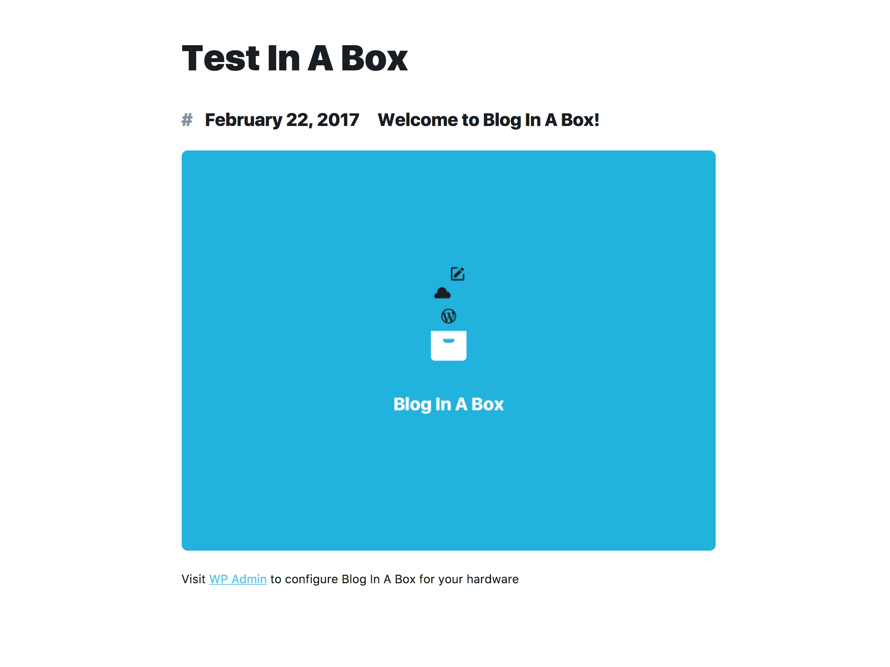

# Blog in a Box WordPress theme

A custom WordPress theme designed for [Blog In A Box](https://inabox.blog/).

Provides a simple single column theme that is configured to make use of a Pi camera photos and SenseHAT readings, and to show these in a simple manner. It is not a fully-featured WordPress theme, and should be treated as a starting point for WordPress/Raspberry Pi mashups.

If widgets are enabled the theme will convert into a two column theme, with the widgets shown on the right.

## Usage

This is a standard WordPress theme and should be placed in `wp-content/themes` and enabled from the WordPress admin interface.

It is primarily designed to be used in conjunction with [Blog In A Box](https://inabox.blog/), although you can use it standalone.

## Contributing

We welcome contributions in any form, and you can help reporting, testing, and detailing bugs.

## License

The Blog In A Box theme is licensed under [GNU General Public License v2 (or later)](./LICENSE.md).
